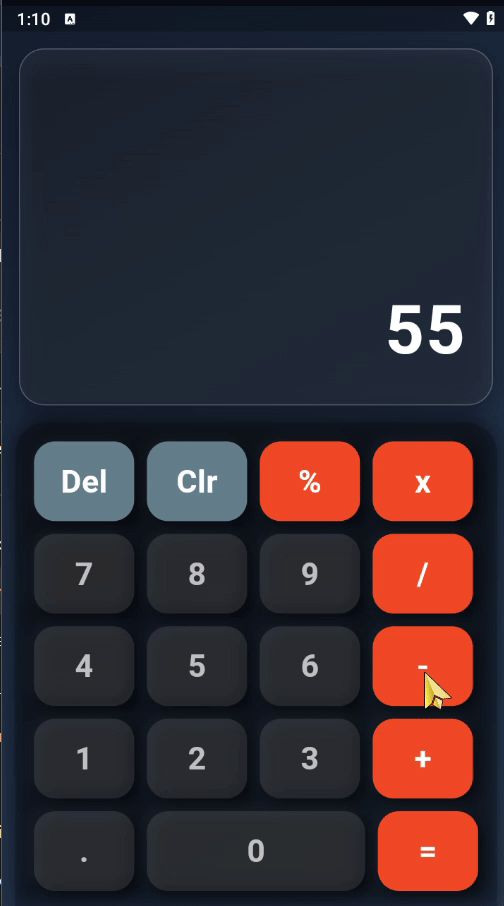

# 📱 Calculator App  

A simple and stylish calculator built with **Flutter**.  
This app supports basic arithmetic operations like **Add, Subtract, Multiply, Divide, and Percentage** with a clean and modern UI.  

[](https://flutter.dev)  


---

## 📑 Table of Contents
- [Features](#-features)
- [Technologies](#-technologies)
- [Screenshots](#-screenshots)
- [Demo](#-demo)
- [Getting Started](#-getting-started)

---

## ✨ Features
- ➕ Addition, ➖ Subtraction, ✖️ Multiplication, ➗ Division  
- % Percentage calculation  
- 🧹 Clear and Delete functions  
- 🎨 Modern & responsive UI design  
- 📱 Works on Android and iOS  

---

## 🛠️ Technologies
- Flutter (Dart)  
- Material Design  
- Android & iOS support  

---

## 📸 Screenshots  

### Home Screen  
  

---

## 🎥 Demo  

**Preview (GIF):**  
  

---

## 🚀 Getting Started  

To run this project locally:  

```bash
# Clone the repository
git clone https://github.com/ManahilHussain70/Calculator_App.git

# Navigate to project directory
cd Calculator_App

# Get dependencies
flutter pub get

# Run the app
flutter run
