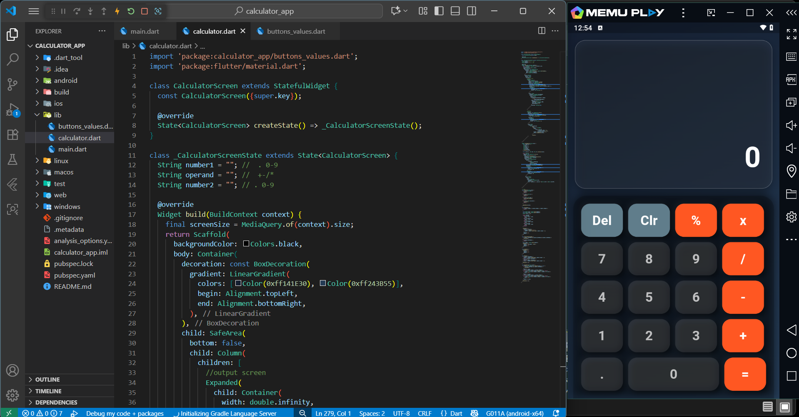

# 📱 Calculator App

A simple and stylish calculator built with **Flutter**.  
This app supports basic arithmetic operations like **Add, Subtract, Multiply, Divide, Percentage** with a clean UI.

---

## ✨ Features
- ➕ Addition, ➖ Subtraction, ✖️ Multiplication, ➗ Division
- % Percentage conversion
- 🧹 Clear and Delete functions
- Modern & responsive UI design
- Works on Android and iOS

---

## 📸 Screenshots

### Home Screen


## 🎥 Demo Video
[Watch the Demo](screenshots/calculator.mp4)


---

## 🚀 Getting Started

To run this project locally:

```bash
# Clone the repository
git clone https://github.com/ManahilHussain70/Calculator_App.git

# Navigate to project directory
cd Calculator_App

# Get dependencies
flutter pub get

# Run the app
flutter run
